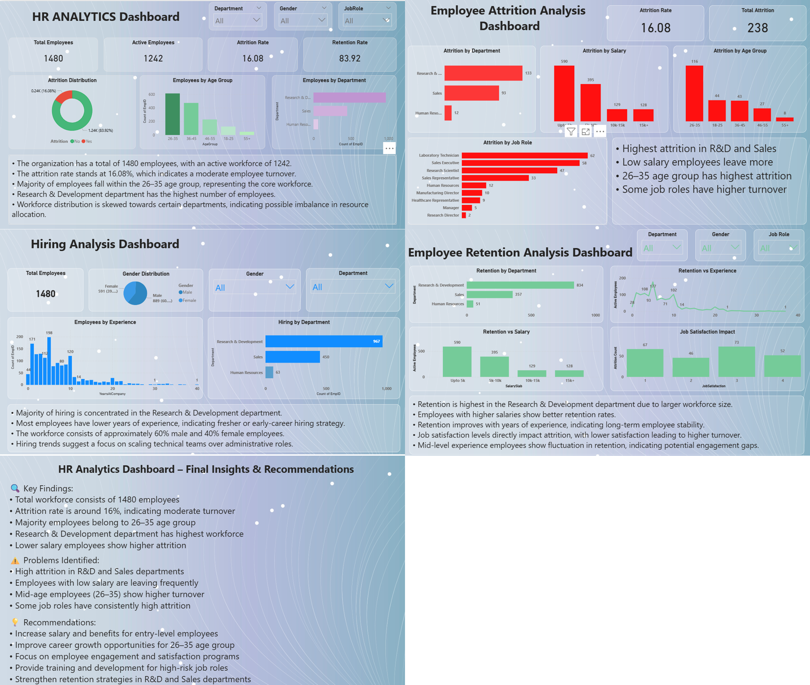

# 📊 HR Analytics Dashboard (Power BI Project)

---

## 📌 Project Overview
The HR Analytics Dashboard is a Power BI project designed to analyze employee data and provide insights into workforce trends, attrition, hiring, and retention.  
It helps organizations make data-driven HR decisions to improve employee satisfaction and reduce turnover.

---

## 🎯 Objectives
- Analyze employee attrition and retention patterns  
- Identify key factors affecting employee turnover  
- Understand workforce distribution by department, age, and salary  
- Provide actionable insights for HR decision-making  

---

## 📂 Dashboard Pages

### 1️⃣ Overview Dashboard
- Total Employees: **1480**
- Active Employees: **1242**
- Attrition Rate: **16.08%**
- Retention Rate: **83.92%**

#### Key Insights:
- Majority employees are in the **26–35 age group**
- Research & Development department has the highest workforce
- Workforce distribution shows imbalance across departments

---

### 2️⃣ Attrition Analysis Dashboard
#### Insights:
- Highest attrition in Research & Development and Sales  
- Employees with lower salary leave more  
- Age group 26–35 shows highest attrition  
- Certain job roles have higher turnover (e.g., Lab Technician, Sales Executive)

---

### 3️⃣ Hiring Analysis Dashboard
#### Insights:
- Most hiring is in Research & Development  
- Employees are mostly early-career professionals  
- Gender distribution:
  - Male: ~60%
  - Female: ~40%

---

### 4️⃣ Employee Retention Dashboard
#### Insights:
- Higher salary → better retention  
- More experience → higher stability  
- Job satisfaction directly impacts attrition  
- Mid-level employees show fluctuating retention  

---

### 5️⃣ Final Insights & Recommendations

#### 🔍 Key Findings:
- Moderate attrition rate (~16%)  
- Young workforce dominates (26–35 age group)  
- High attrition in specific departments and roles  

#### ⚠️ Problems Identified:
- High turnover in R&D and Sales  
- Low salary employees leaving frequently  
- Engagement issues in mid-level employees  

#### 💡 Recommendations:
- Increase salary & benefits for entry-level employees  
- Improve career growth opportunities  
- Enhance employee engagement programs  
- Provide training for high-risk job roles  
- Strengthen retention strategies  

---

## 🛠️ Tools & Technologies
- Power BI Desktop  
- Data Visualization  
- Data Cleaning & Modeling  

---

## 📸 Dashboard Preview

---

## 🚀 How to Use
1. Download the `.pbix` file  
2. Open in Power BI Desktop  
3. Explore dashboards using filters and slicers  

---

## 📌 Project Title
**HR Analytics Dashboard: Employee Attrition & Retention Insights**
